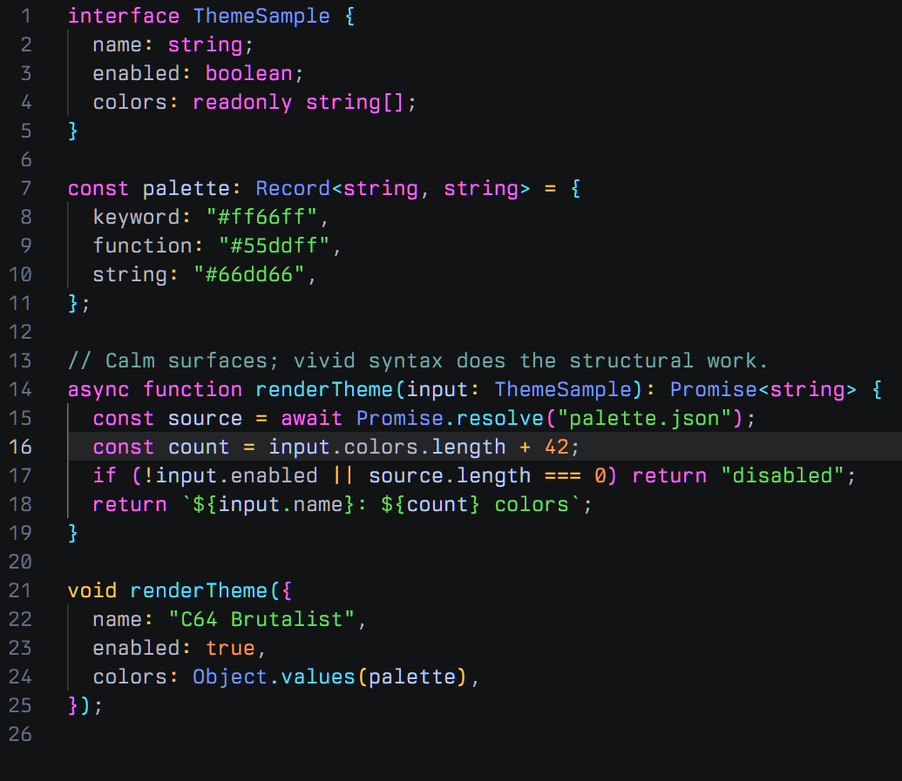

# C64 Brutalist

A dark, low-glare theme family for Visual Studio Code and Cursor. Saturated early-PC colors make syntax structure obvious without turning the whole workbench into neon.

- **C64 Brutalist** uses calm blue-gray surfaces.
- **C64 Brutalist Darker** keeps the same pastel syntax palette over the exact workbench surface hierarchy from VS Code's Dark 2026 theme: `#121314` editor, `#191a1b` chrome, `#202122` widgets, and `#242526` raised content.



The Darker workbench surface hierarchy is derived from [VS Code Dark 2026](https://github.com/microsoft/vscode/blob/main/extensions/theme-defaults/themes/2026-dark.json); its syntax and semantic colors remain C64 Brutalist.

## Palette

| Role | Color |
| --- | --- |
| Brutalist editor | `#202430` |
| Brutalist raised surface | `#262b38` |
| Darker editor | `#121314` |
| Darker chrome | `#191a1b` |
| Darker widget | `#202122` |
| Selection | `#394254` / Dark 2026 selection tones |
| Text | `#b6bac8` |
| Secondary text | `#939bac` |
| Accent | `#a2abcf` |
| Comment | `#77aaaa` |
| Keyword | `#ff66ff` |
| Function | `#55ddff` |
| Variable | `#bbccff` |
| String | `#66dd66` |
| Number | `#ff9955` |
| Type | `#7799ff` |
| Operator | `#ffcc55` |
| Error | `#ff7777` |

The integrated terminal uses the same ANSI palette. Semantic highlighting is enabled, so language servers retain the same type/function/variable distinctions as TextMate grammars.

## Install

Download `c64-brutalist-theme-1.0.0.vsix` from the latest GitHub release, then run either:

```powershell
code --install-extension .\c64-brutalist-theme-1.0.0.vsix
cursor --install-extension .\c64-brutalist-theme-1.0.0.vsix
```

Select **C64 Brutalist** or **C64 Brutalist Darker** with **Preferences: Color Theme**. The extension changes colors only; it does not modify fonts, keybindings, editor behavior, or extensions.

## Develop

Open this repository in VS Code or Cursor and press `F5` to launch an Extension Development Host. Package locally with:

```sh
npx --yes @vscode/vsce package
```

## License

All rights reserved. See [LICENSE](LICENSE).
